# 🛒 E-Commerce Application (Single Vendor)

A full-stack **single-vendor eCommerce application** built using **Spring Boot (Java)** for the backend and **React** for the frontend.  
The application allows users to browse products, add them to cart, and place orders, while the admin manages products, users, and orders.

---

## 🚀 Features

### 👤 User Features
- User registration & login
- Browse available products
- Add products to cart
- Update cart items
- Place orders
- View order history

### 🛠️ Admin Features
- Admin authentication
- Create, update, and delete products
- View and delete users
- View all orders
- Update order status (e.g., Pending, Shipped, Delivered)
- Delete orders

---

## 🧰 Tech Stack

### Backend
- Java
- Spring Boot
- Spring Security
- Spring Data JPA (Hibernate)
- RESTful APIs
- MySQL (configurable)
- Maven

### Frontend
- React
- JavaScript (ES6+)
- Axios (API calls)
- React Router
- Tailwind

---

## 🏗️ Application Screenshots
### USERS POV OPERATIONS
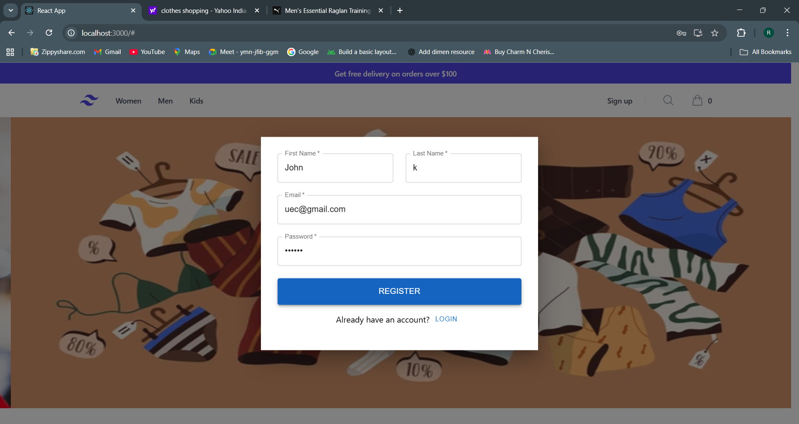

---
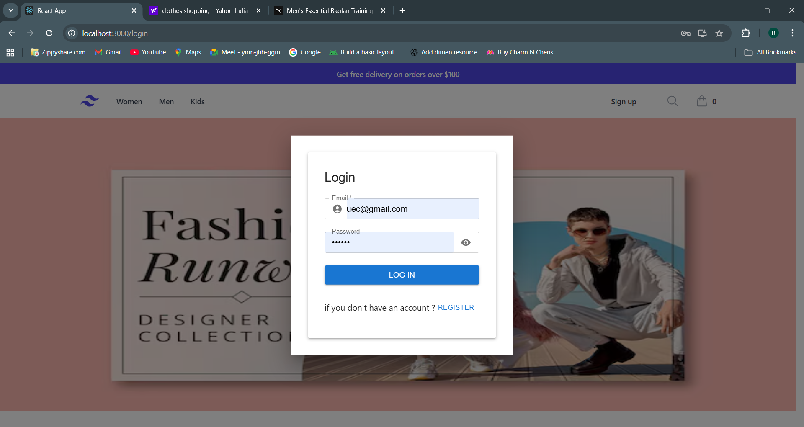

---
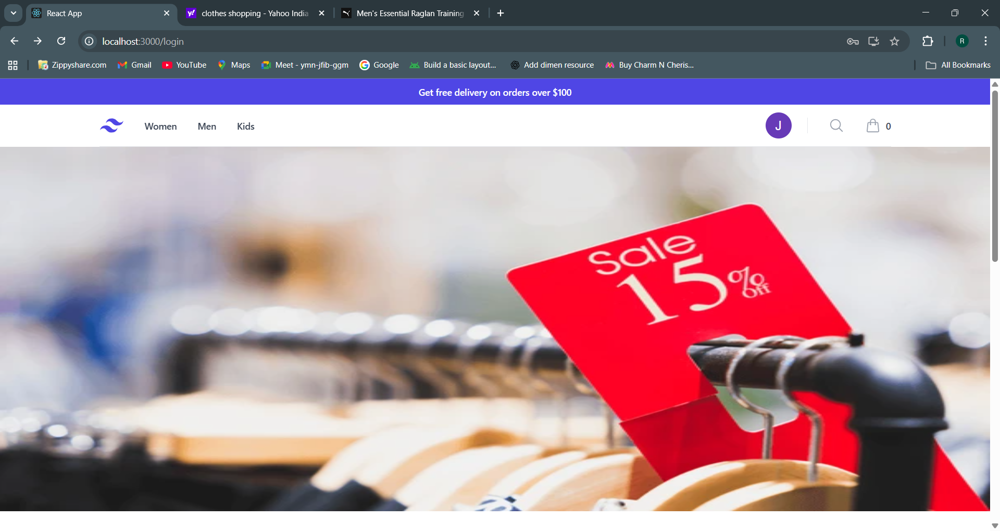

---
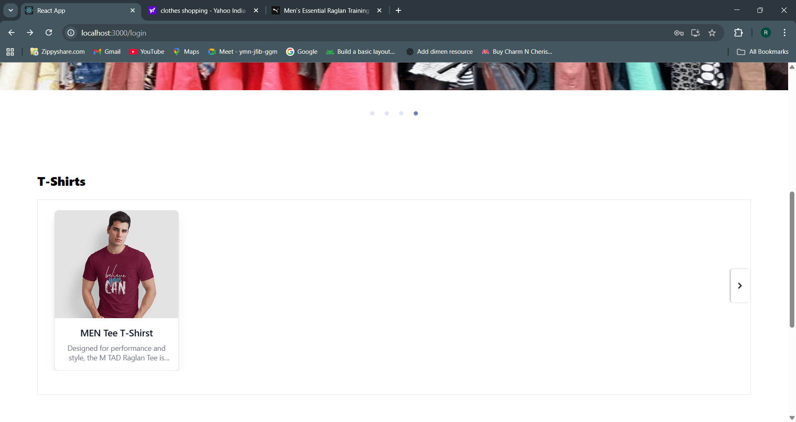

---
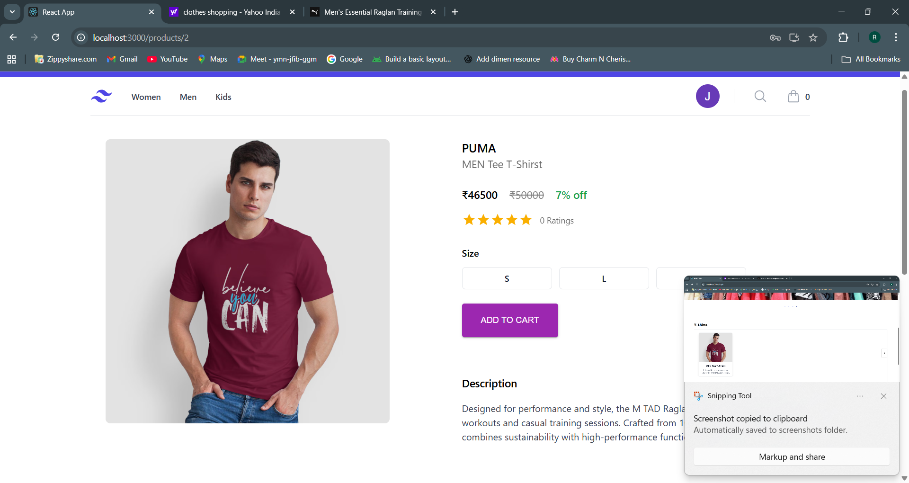

---
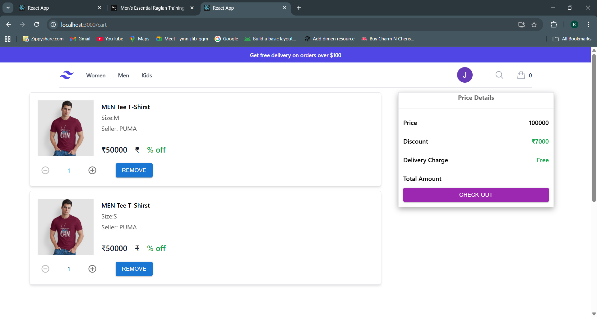

---
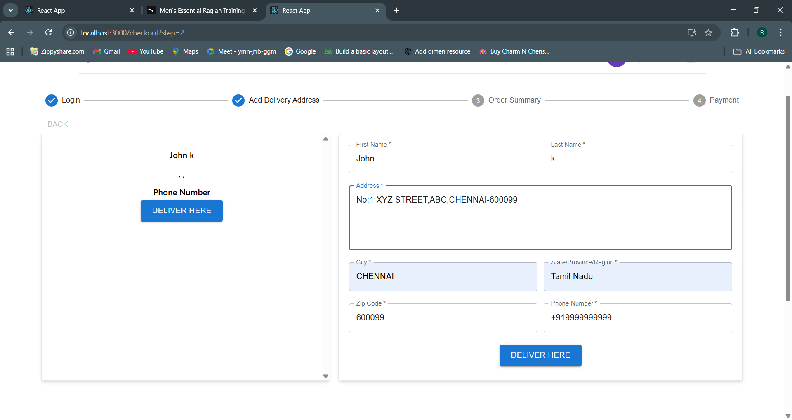

---
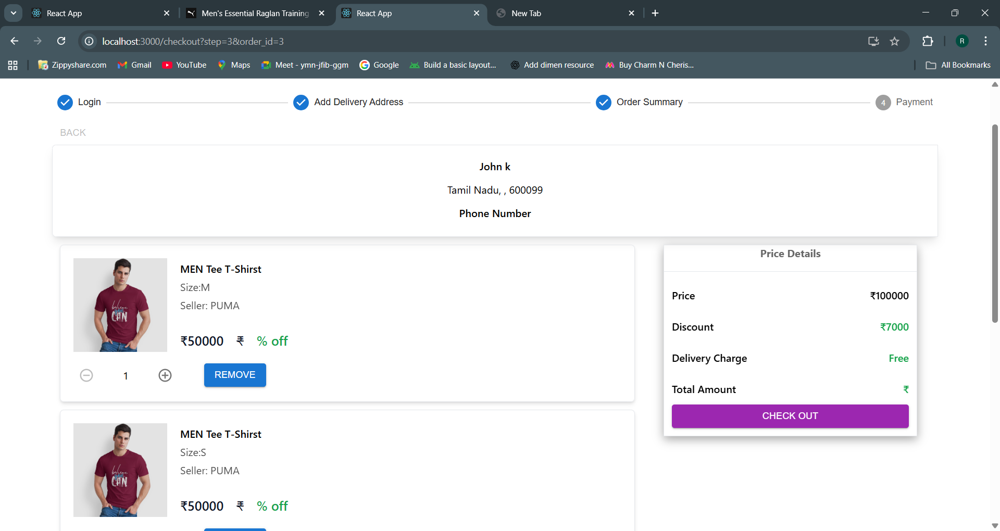

### ADMIN POV OPERATIONS
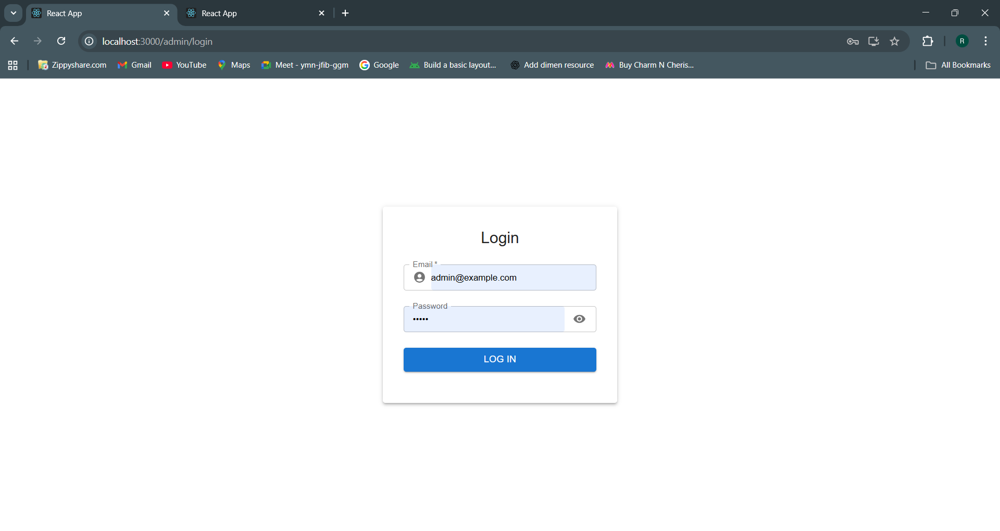

---
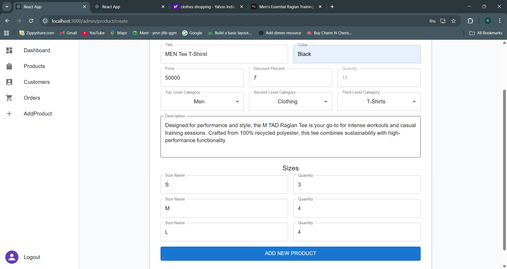

---
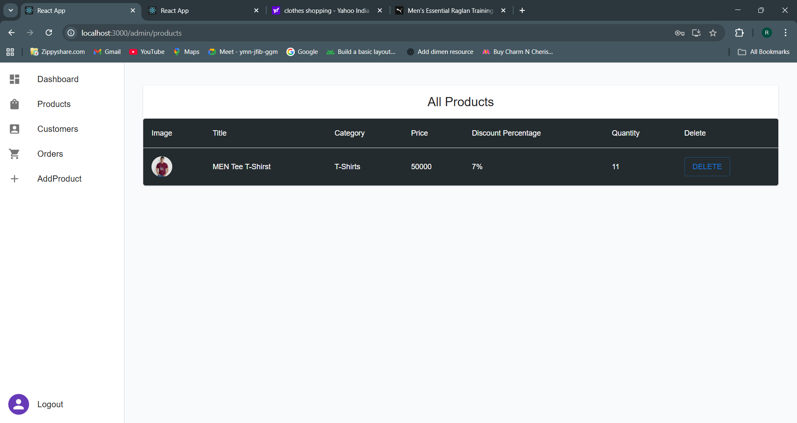

---
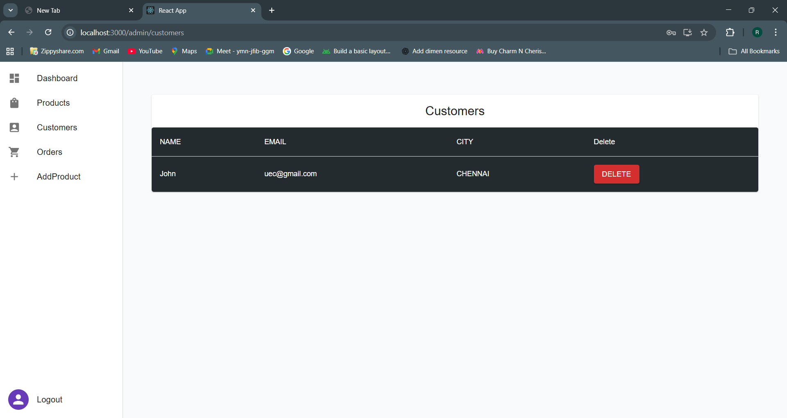

---
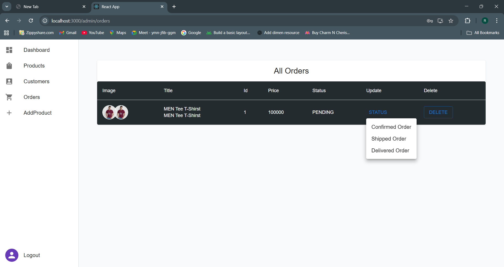

---
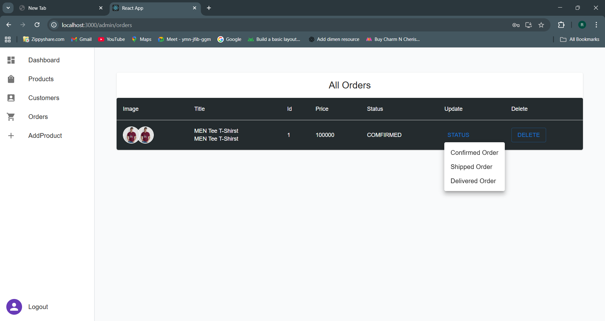

---
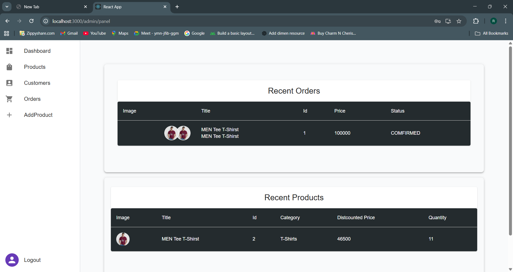

---

---

